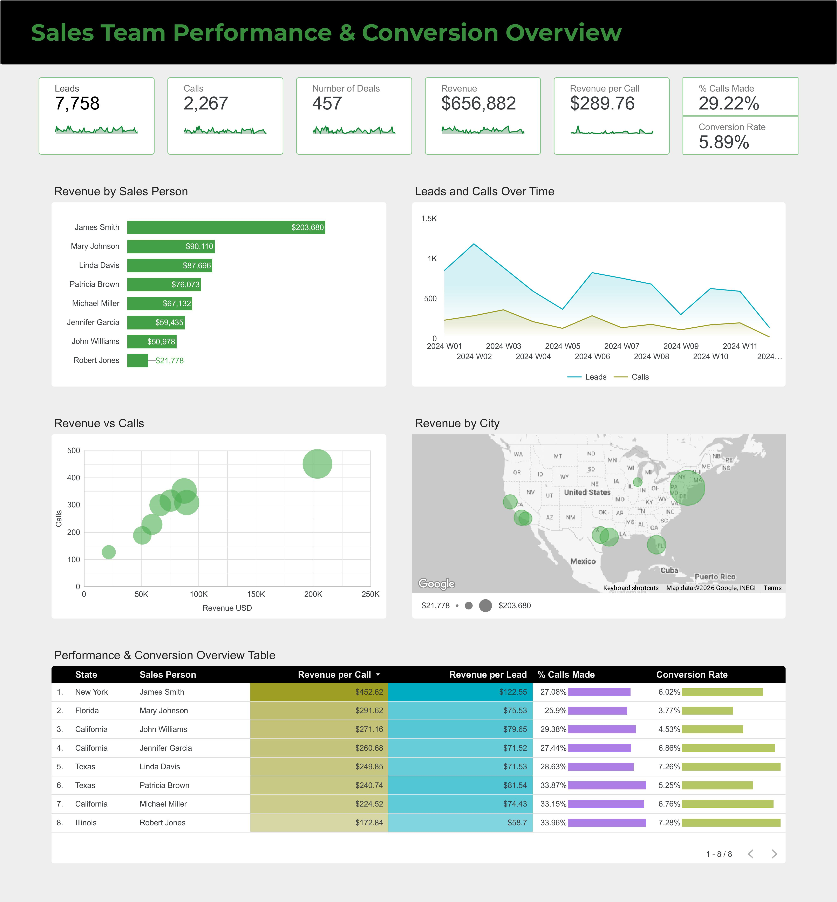

# My Looker Studio Projects 

## Project 1: Sales Team Performance & Conversion Overview (Jan - Mar 2024)

### Business Problem
Sales leadership needs visibility into how team activity turns into revenue and where coaching or support is required.

### Goal
Provide a single view to track effort, efficiency, and outcomes across sales reps and cities.

### Tools Used
- Looker Studio
- Google Sheets 
- Calculated fields & KPIs

### KPIs
- Leads
- Calls
- Number of Deals
- Revenue
- Revenue per Call
- % Calls Made
- Conversion Rate

### Additional Calculated Fields
- Revenue per Lead

### Key Questions Answered
- Who generates the most revenue?
- Are calls translating into results?
- Which reps are most efficient?
- Which cities perform best?
- Are trends improving over time?

### Dashboard Preview

### Insights:
- James Smith leads by a wide margin, generating over $200K, more than double several teammates.
- Some sales reps show strong outreach but lower revenue per call and conversion rates.
- New York delivers the strongest revenue per lead. This suggests higher buying intent or better positioning in that market, making it a candidate for increased investment and scalable best practices.
- More calls do not always mean more revenue. Some reps may benefit from conversion coaching.
- Lead value differs by city. Expanding effort in high-return markets can increase revenue efficiency.

### Live Dashboard
https://lookerstudio.google.com/reporting/7305a389-8de8-4e26-b56c-6f1d4c353174
